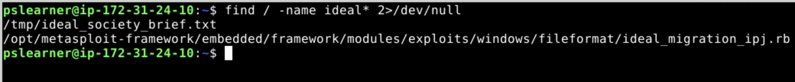
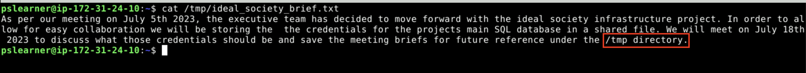
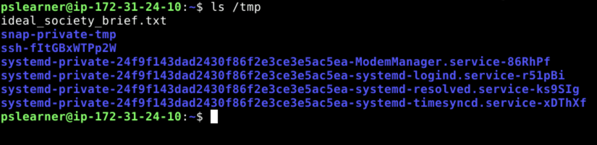
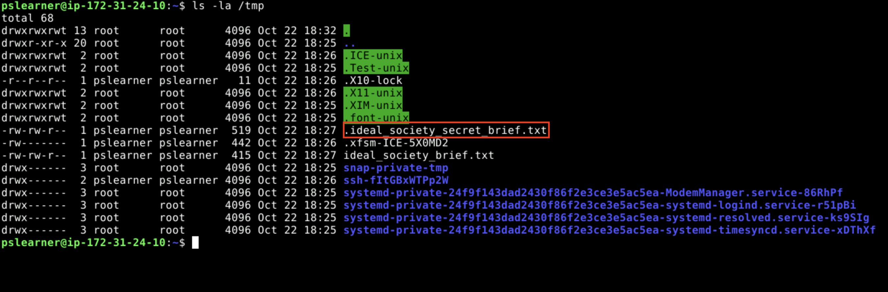
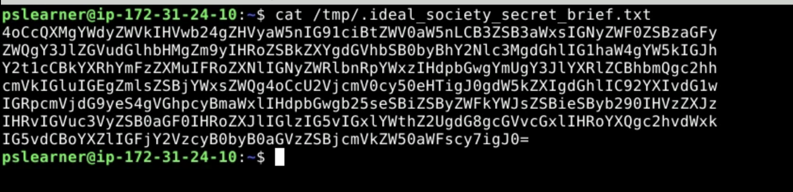
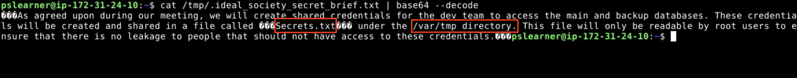
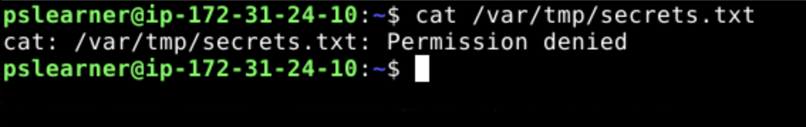
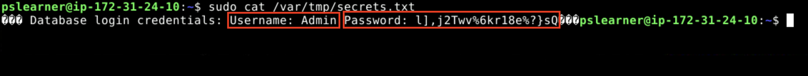

# Exploring the Linux File System, Bypassing Encoding and Priviledge Escalation
## Lab Description: In this challenge, you will explore a linux system in search of sensitive files and uncover their secrets.

The notorious hacking group Dark Kittens has struck again! Who are they? What do
they want? And how are they so good? Globomantics runs an artificial island in the
Gulf of Mexico, attempting to build an infrastructure for the “ideal society.” They have
fallen victim to repeated attacks and have issued an international bounty for anyone
willing to take these hackers down (is that even legal?). It’s time for you to choose a
side.

In this lab we will be acting as the dark kittens hacking group.
We have already gained access to one of the company's systems,
now it's time to examine the system, find information on their plans
and find a way to stop them! 

First things first, let's configure the environment.

1. Click on the Applications button in the top-left and open the Terminal Emulator.

2.  In the console window, type `chmod 755 Lab_setup.sh` and hit enter, then type `./Lab_setup.sh` and hit enter.

3. Our first goal is to identify any files that may be related to the "ideal society" project. 
To do this let's run a command that will scan the entire file system for any files that has the word "ideal" in it's name.

4. In the terminal emulator run the command `find / -name ideal* 2>/dev/null`.

**Note:** The command `2>/dev/null` allows us to filter out all responses that give us errors, making it much easier to find the files of interest. 
You can try running this command without that addition to see how many error messages we can get looking for files.

5. Now we can see from our results that we found one file that seems very promising, let's read it.

6. In the terminal emulator run the command `cat /tmp/ideal_society_brief.txt`.

7. Based on the information found in the brief there should be another file with hints on where we can get some database credentials.
As a next step let's search the tmp directory and see if we can find that file.

8. In the terminal emulator run the command `ls /tmp`.

9. We get no hits on any new files. However, that doesn't always mean that there are no files present, let's run a new command to look for any hidden files.

**Analysis:** In linux files can be hidden from normal view but adding a `.` at the beginning of it's name. To find those files we can use a more refined `ls` command.

10. In the terminal emulator run the command `ls -la /tmp`.

11. Now we see that there is another file hidden in this directory, let's try reading this file.

12. In the terminal emulator run the command `cat /tmp/.ideal_society_secret_brief.txt`.

13. Based on the output it looks like this file has been encoded, making it impossible to read in this form. 
This is not uncommon when you are looking at sensitive information that people want to protect. However, based
on the equal sign at the end it looks like its base64 encoded, as a next step let's try to decode it.

**Analysis:** Encoding is process of converting a message to specialized format. In the context of cybersecurity
this is often done to prevent a message from being read by someone who is not the intended recipient. The process
of decoding is to revert that text back to it's original form.  

14. In the terminal emulator run the command `cat /tmp/.ideal_society_secret_brief.txt | base64 —decode`.

15. It looks like that worked and we are able to read the message. It looks like the credentials are stored in a file in the /var/tmp directory
in a file called secrets.txt. Let's try to read it.

16. In the terminal emulator run the command `cat /var/tmp/secrets.txt`.

17. It seems we don't have permissions to read this file. 
In order to bypass this we need to do what's called privledge escalation.
This is where we look to elevate our privileges on the system so that we can run commands
that we normally wouldn't be able to run.

18. To accomplish this we are going to use a command called super user do (`sudo`), to attempt
to read the file as the root user.

19. In the terminal emulator run the command `sudo cat /var/tmp/secrets.txt`.

**Analysis:** This final screenshot shows us exposed credentials to the company database.
As a hacker in this situation we would be able to use these credentials to connect
to the database, read and export everything that is stored there and ultimately delete
information to hinder the organization's ability to complete their project. 

In the next lab we'll look at persistence techniques, which are technques hackers
can you use to ensure that they can continue to access a computer system once
they have intially hacked it without raising suspiscion. 

